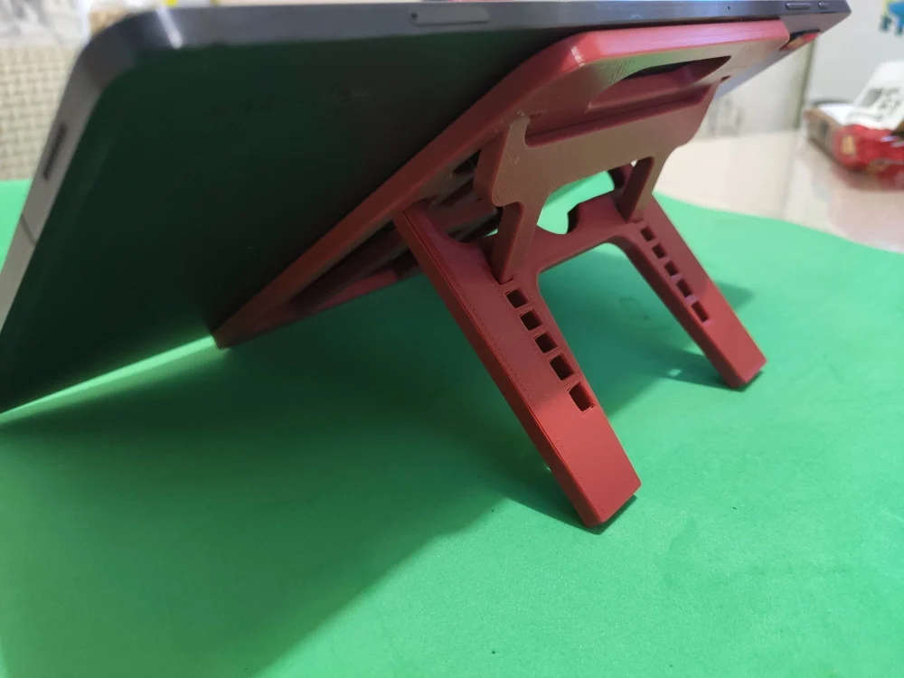
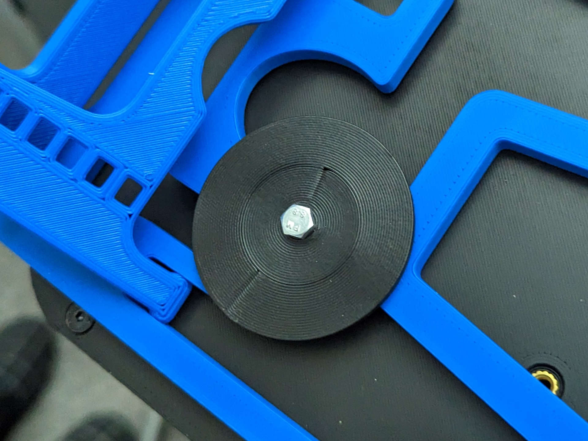

# Ergo S-1 Extras

This repo is intended to offer extras that may be useful when building your [Ergo S-1 keyboard](https://github.com/wizarddata/Ergo-S-1).

If you want to build the keyboard, see [the original repo for this project](https://github.com/wizarddata/Ergo-S-1).

## Extra purchase list info

This document has some information and pictures that can be used to help guide your purchase decisions when building your Ergo S-1 keyboard.

[Extra purchase list info](https://github.com/arcanemachine/Ergo-S-1/blob/main/extra-purchase-list-info.md)

## Customize the firmware

If you want to customize the keymaps and/or build your own version of the ZMK firmware for this keyboard, check out [this repo](https://github.com/arcanemachine/zmk-ergo-s-1).

## Printable tenting stand

I found a 3d-printable tablet stand on Thingiverse which works well as an adjustable tenting stand for the Ergo S-1:

- [Thingiverse - Print-in-Place Netbook&Tablet Stand](https://www.thingiverse.com/thing:4861555)

Since it's licensed [CC BY-NC](https://creativecommons.org/licenses/by-nc/4.0/), I added [a copy of the STL](https://github.com/arcanemachine/Ergo-S-1/blob/main/STL/tenting-stand.stl) to this repo.

To keep everything from sliding around, I put a big rubber mat under my keybaord. For maximum cheapskate-ness, I used a kitchen drawer liner mat that I got at the dollar store.

I also used [a couple of these 3d-printed "washers"](https://github.com/arcanemachine/Ergo-S-1/blob/main/STL/tenting-stand-mount.stl) (and 2 M4x15mm screws) to secure the bottom of the keyboard to the tenting stand (it attaches to one of the heat-set inserts on the bottom). Not perfect, but better than just letting the keyboard just sit on the tenting stand.

Thanks to [mishkin2](https://www.thingiverse.com/mishkin2/designs) for this excellent creation!

## Licenses

Any content in this repo that is not covered by any other license is subject to the terms of the [MIT-0 license](https://github.com/arcanemachine/Ergo-S-1/blob/main/LICENSE).

Any derivative works from the original Ergo S-1 repo are subject to [the CERN-OHL-S v2 licence](https://spdx.org/licenses/CERN-OHL-S-2.0.html) as described in [the original Ergo S-1 repo](https://github.com/wizarddata/Ergo-S-1/commit/58e50b198b7f7b34e3af4004d18da98f1de46546#diff-fd715bfdd30476d39e0594585a4c7730567b89caf4fce2f8d88e4f4b1bb5ec4e).

The 3d-printable tenting stand in this repo is subject to the terms of [CC BY-NC](https://creativecommons.org/licenses/by-nc/4.0/).
