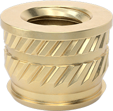
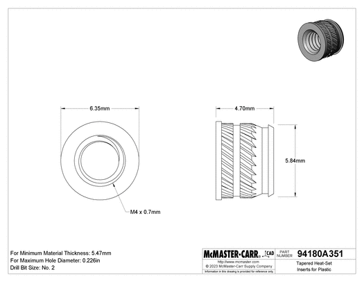
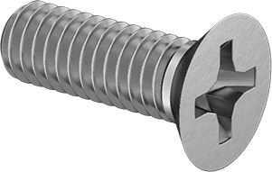
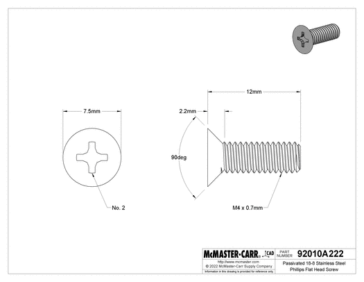
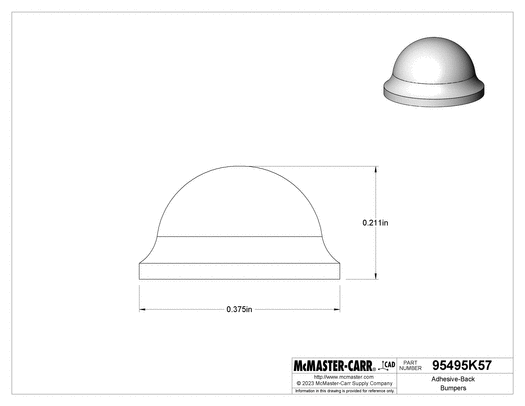
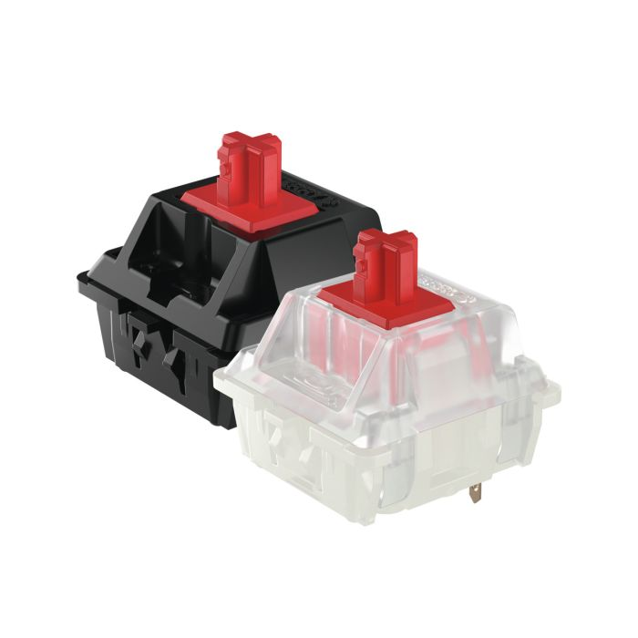
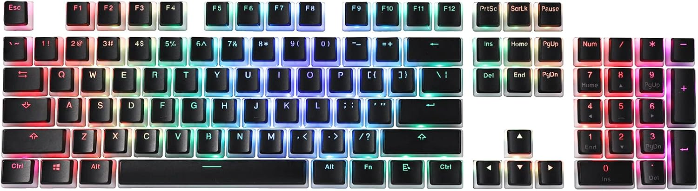
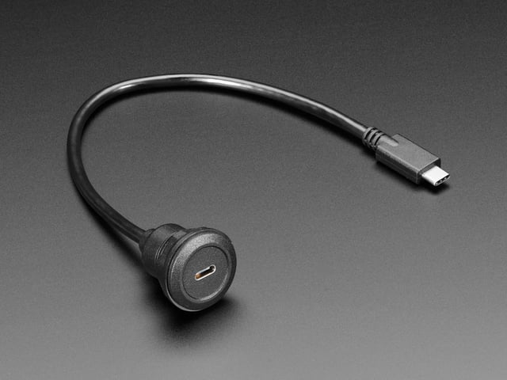
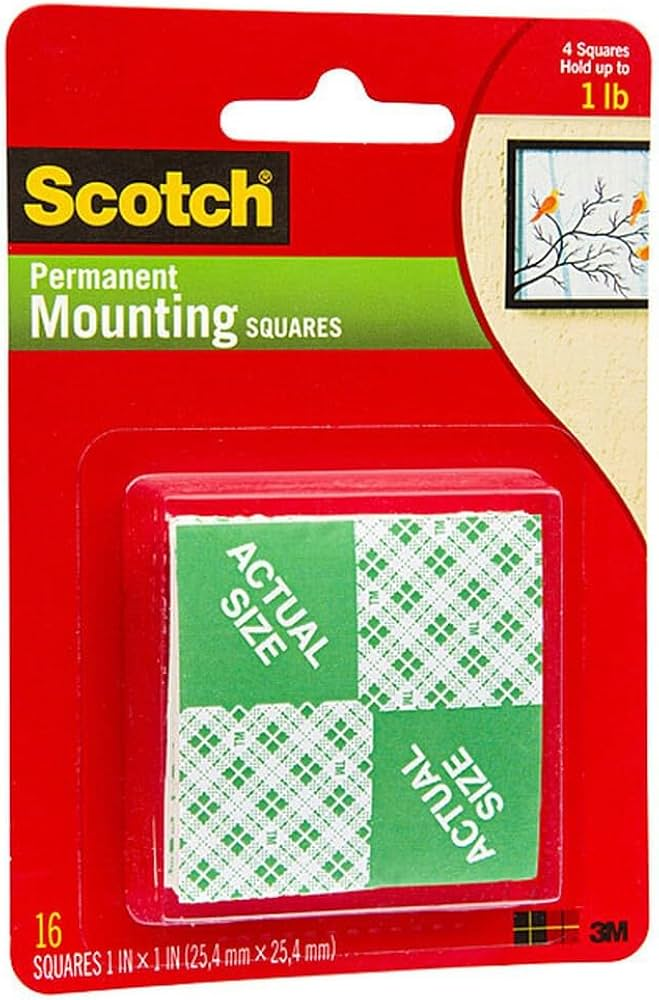

# Extra Purchase List Info

> WARNING: Some of the information in this document is unconfirmed or may recommend customized parts that I haven't created yet. However, most of the information in this document can currently be used to help guide your purchasing decisions. See [TODO.md](TODO.md) for more specific info.

---

> NOTE: The information in this document complements (but does not replace) the information in the official assembly instructions. Ensure that you read both.

This document is meant to add some helpful info to the purchase list in the official assembly instructions, e.g. add some context, backup links, images, etc. It also adds links to some AliExpress and Amazon listings so that non-American users can easily purchase the required materials. Archive links are included whenever possible so that info is available if any of the live links go offline.

> DISCLAIMER: This document uses images from AliExpress, McMaster-Carr, and Amazon. The use of these images is non-commercial and educational. No affiliate links are used.

## 12x M4 Heat Set Inserts

McMaster-Carr product name: Brass Tapered Heat-Set Inserts for Plastic (M4 x 0.7 mm Thread Size, 4.7 mm Installed Length)

### Notes

- The heat-set inserts from McMaster-Carr can be substituted with some cheaper ones from AliExpress. The AliExpress ones have a different shape but work the same.

- The McMaster ones have a length of 4.7mm. The AliExpress ones that I bought had a length of 6mm and an outer diameter of 6mm and worked fine, despite having a different profile (and length) than the tapered McMaster ones.

### Images

McMaster-Carr:

AliExpress:

### Links

McMaster-Carr: https://www.mcmaster.com/94180A351/

AliExpress: https://www.aliexpress.com/item/1005003582355741.html

AliExpress (archive link): https://archive.is/pgXW8

## 12x M4 Bolts

McMaster-Carr product name: Passivated 18-8 Stainless Steel Phillips Flat Head Screw (M4 x 0.7 mm Thread, 12 mm Long)

### Images

### Links

McMaster-Carr: https://www.mcmaster.com/92010A222/

AliExpress: https://www.aliexpress.com/item/4001199728978.html

AliExpress (archive link): https://archive.is/xDFXV

## 10x Silicone Adhesive Feet

McMaster-Carr product name: Adhesive-Back Bumpers (Polyurethane Rubber, 3/8" OD, 7/32" High, Durometer 50A, Clear)

### Images

### Notes

- Anything with a width of up to 10mm OD and a minimum height of 3 (maybe 2?) mm should work.

- You can buy flat ones, but the rounded ones are probably better since the flat ones might wobble.

### Links

McMaster-Carr: https://www.mcmaster.com/95495k57/

Amazon Canada (I used these ones): https://www.amazon.ca/dp/B07LGK6RWN

Amazon Canada (archive link): https://archive.is/nRHn2

AliExpress: https://www.aliexpress.com/item/1005003044229837.html
	- NOTE: I haven't tried these ones, but they should work.

AliExpress (archive link): https://archive.is/NkYHq

## 68x Cherry / Gateron Switches

### Notes

- As mentioned in the official assembly instructions, ensure that you buy MX-style switches. Other styles will not fit in the 3D-printed slots.

- Make sure you buy from a reputable dealer to ensure you don't end up with counterfeit switches.

### Images

## Cherry/OEM/DCS 104-Key Keycap Set

### Notes

- The keycaps will probably not be a one-to-one match for your keyboard mappings. If this bothers you, then you will probably want to get a blank set of keycaps.

### Images

### Links

- Amazon Canada (I used these ones): https://www.amazon.ca/dp/B096ZZ8R34

- Amazon Canada (archive link): https://archive.ph/w14r7

- AliExpress: https://www.aliexpress.com/item/1005005979935288.html

- AliExpress (archive link): https://archive.ph/wip/yAb6w

## 68x Diodes

Product name: 1N4148 diode

### Notes

- Make sure you get 1N4148 diodes. You need at least 68 of them.

### Links

- AliExpress: https://www.aliexpress.com/item/4000142272546.html

- AliExpress (archive link): https://archive.ph/8ImEI

## Insulated Wire

Product name: Stranded 30ga silicone insulated wire

### Notes

- 30ft (10 meters) will be sufficient to complete the job

- The docs use alternating colors, but a single color is just as easy to work with (in my opinion).

### Links

- AliExpress: https://www.aliexpress.com/item/1005001626937991.html

- AliExpress (archive link): https://archive.ph/wip/96V76

## Wireless Microcontrollers

Product name: nice!nano v2 (or a cheaper clone)

### Notes

- The assembly instructions recommend using a nice!nano. You can save a good bit of money by using a cheaper clone instead. You can use a "SuperMini nRF52840", but an even cheaper clone (~$7 USD) is available on AliExpress (linked below).

- The nice!nano clone I bought on AliExpress can be used with the Ergo S-1 firmware without any modification. I found that it works as a drop-in replacement for any firmware designed for the nice!nano.

- Some of the earlier runs of the AliExpress clones use the wrong size resistor (5.6K ohm instead of 10M ohm) or do not support battery charging. The newer versions support both. The newer version (the one you want) of the board sold by "TENSTAR Choice Store" on AliExpress will have the following pieces of information in the description (the text is in the images so Ctrl+F won't work):
	- "Battery charging chip: Support lithium battery charging and discharging"
	- "Power consumption: The standby power consumption can reach ~20uA"

### Links

- AliExpress: https://www.aliexpress.com/item/1005006446457448.html

- AliExpress (archive link): https://archive.ph/wef1J
	- NOTE: If you open this archived link, you can right-click the listing's main image link, then open it in a new tab to see the image text described above (the one that I only saw with the newer runs of the board).

## 2x Panel Mount USB-C

USB C Round Panel Mount Extension Cable

### Notes

The AliExpress version of this product doesn't fit in the [original printed keyboard case](https://github.com/wizarddata/Ergo-S-1).

Here are some of the options available:
	- If you are able to buy the adapter from Adafruit, then you can just use the default version of the print.
	- If you bought a different version of the adapter that will not fit the default version of the printed keyboard case, then you have 2 options:
		- Print a small adapter so that your adapter can fit into the original printed keyboard case. (*** LINK COMING SOON ***)
		- Print my modified keyboard case (*** LINK COMING SOON ***) that allows you to use the adapter without any further modifications.

### Images

Adafruit:

AliExpress:

## 2x Panel Mount Reset Switch

Product name: 16mm Panel Mount Momentary Pushbutton

## Notes

- The AliExpress version of this item can be used in place of the Adafruit item without any modifications.

- If you use the AliExpress version of this item, get the 3-6 volt, self-resetting, 16mm switch with no LED.

## Images

## Links

- Adafruit: https://www.adafruit.com/product/1505

- Adafruit (archive link): https://archive.ph/F4unl

- AliExpress: https://www.aliexpress.com/item/1005005569487108.html

- AliExpress (archive link): https://archive.ph/1xaJV

## 2x Battery

Lithium Ion Battery - 2Ah

## Notes

- Ensure that you buy a 3.7 volt lithium battery.

- Ensure that you buy a battery with protection circuit (e.g. overcharge/overvoltage protection, overdischarge/undervoltage protection, short-circuit protection, etc.)

- The battery linked in the official assembly docs is 2.0 mAh. This battery will last approximately 6 months between charges. You can buy a smaller/larger battery if you want to. Just ensure that the battery has the proper voltage.

- The battery linked in the official assembly docs uses a standard 2-pin JST-PH connector. You don't need to buy a battery with this connector. You will end up cutting off the connector and soldering the two wires directly to the microcontroller anyway.

- If you want, you can also use a removable battery instead. See the 18650 battery and holder in the "Additional Items" section at the end of this document.

## Links

- Amazon Canada: https://www.amazon.ca/dp/B095BRVD96

- Amazon Canada (archive link): https://archive.ph/kIaNr

## Hot Glue Gun

I didn't end up needing this. It was supposed to be used to secure the microcontroller to the case, but I just used the double-sided tape (a.k.a "mounting squares") instead.

## Double Sided Tape

For this, I used some "mounting squares" that I got at the hardware store, and trimmed them to size as needed. Worked like a charm.

### Images

### Links

- Adafruit: https://www.adafruit.com/product/4218

- Adafruit (archive link): https://archive.ph/F24r6

- AliExpress: https://www.aliexpress.com/item/1005006343795766.html

- AliExpress (archive link): https://archive.ph/2Q8TJ

## Additional Items

These items are not described in the official assembly instructions, but may be useful nonetheless:

### Rubber O-Ring Dampeners

The keycaps I bought had a bit of a cheap, clacky sound. The keyboard worked fine, but adding some rubber o-ring dampeners improved the sound and feel of the keyboard.

#### Notes

- I used a single `OD 9x2.5mm` ring per keycap

#### Links

- AliExpress: https://www.aliexpress.com/item/1005006333949936.html

- AliExpress (archive link): https://archive.ph/wip/pige6

### 2x 18650 Battery

If you want to easily remove or swap the battery from your keyboard, just use an 18650 battery and holder. For information on the battery holder, see the section about [battery holders](#2x-18650-battery-holder).

#### Notes

- Ensure that you get a 3.7 volt battery.

- Ensure that you get a battery with a built-in protection circuit. This prevents damage to the battery, or even the risk of a fire.

- Make sure that you buy from a reputable supplier. Counterfeit 18650 batteries are incredibly common.

### 2x 18650 Battery Holder

This can be used to make it easier to swap out batteries. Also, this makes it easy to remove the battery if you intend to store the keyboard for a long period of time.

### Notes

- The battery holder can be held in place with the [mounting squares](#double-sided-tape). I attached mine in the area with the two screw holes in the bottom of the keyboard.

### Images

### Links

- AliExpress: https://www.aliexpress.com/item/1005002592649419.html
    - NOTE: The linked item comes in a 3-pack of single-battery holders.
		- Stick with the single-battery holder. A single battery will be sufficient to power the keyboard for months.

- AliExpress (archive link): https://archive.ph/wip/vdJLO
